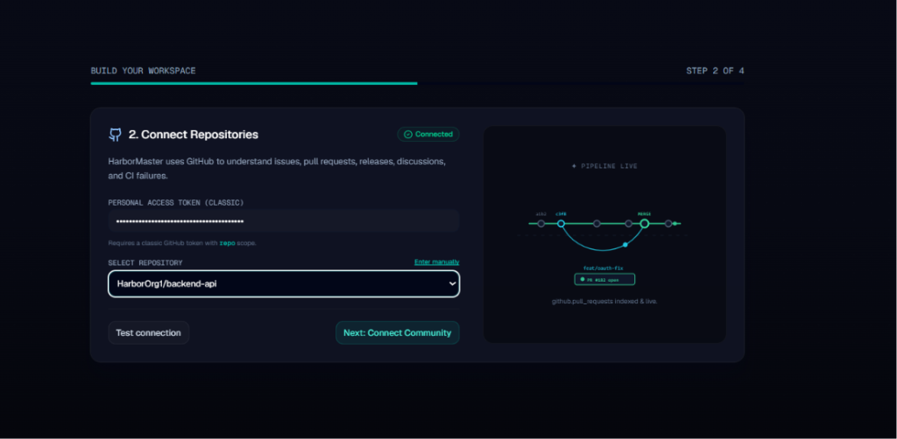
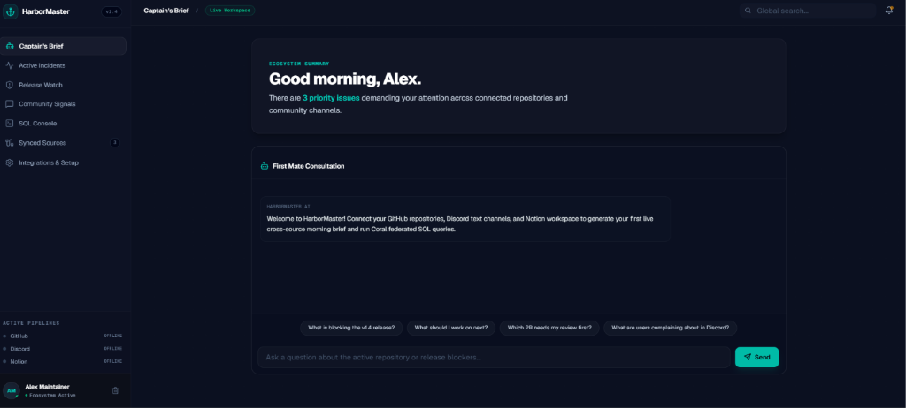
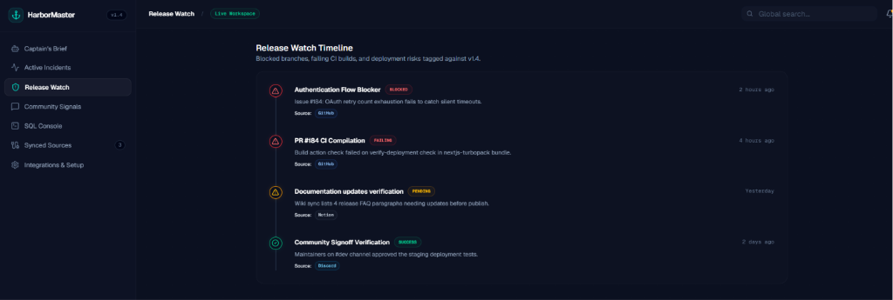
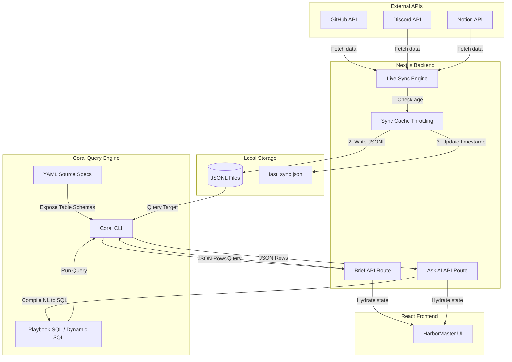

# ⚓ HarborMaster

> **Your AI First Mate for Open-Source Projects.**  
> An intelligent command center that joins **GitHub** repositories, **Discord** support channels, and **Notion** workspaces in a single federated SQL interface to prioritize what you should fix, review, or ship next.

<div align="center">
  
</div>

<br />

<div align="center">
  
  
  
  
</div>

---

## ⚡ Core Features

*   **Federated SQL Data Layer:** Treats external SaaS data as standard relational database tables using the **Coral Query Engine**. Perform cross-source joins (like matching Discord support tickets directly to open GitHub Pull Requests) in standard SQL.
*   **Agentic AI Reasoning Loop:** Powered by **Google Gemini**. HarborMaster dynamically writes SQL to solve natural-language questions, reasons over the retrieved evidence, and compiles an actionable **Captain's Brief**.
*   **Local-First Sync Cache Engine:** Normalizes active API streams into local `.jsonl` database files with a smart 2-minute caching throttle. Boosts query latency to **sub-milliseconds** while preventing third-party API rate-limit exhaustion.
*   **Stateless Cookie-Backed Security:** API tokens and keys are stored client-side inside secure browser cookies. Sensitive keys are obscured on screen and never stored in a centralized database, ensuring self-custody of your secrets.
*   **Vercel Serverless Ready:** Dynamically adjusts runtime paths to Vercel's writeable `/tmp` partitions, mapping schema configurations on-the-fly.

---

## 📸 Guided Walkthrough

### 1. Interactive 4-Step Onboarding Wizard
Connect your GitHub account (supporting OAuth or Personal Access Tokens), select multiple repositories via checklist, specify comma-separated Discord support channels, and input Notion credentials.
<div align="center">
  
</div>

### 2. Natural Language AI Chat Agent
Ask any natural language questions in the command bar. The Agent will dynamically compile the prompt into standard SQL, execute the query across your sources, and present natural language answers complete with links to the source artifacts.
<div align="center">
  
</div>

---

## 🏗 System Architecture



---

## 🛠 Setup & Installation

### Local Development

1.  **Clone the Repository:**
    ```bash
    git clone https://github.com/Abk700007/HarborMaster.git
    cd HarborMaster
    ```

2.  **Install Dependencies:**
    ```bash
    npm install
    ```

3.  **Run Dev Server:**
    ```bash
    npm run dev
    ```
    *Note: During build, Next.js will automatically run `scripts/prebuild.js` to download the appropriate pre-compiled Coral binary for your operating system.*

4.  **Open in Browser:** Go to `http://localhost:3000` to start the onboarding wizard.

---

## 📜 Example Coral SQL Playbook

Here is the exact SQL statement HarborMaster executes via Coral to compile the **Morning Brief**, joining open GitHub PRs with corresponding Discord bug report logs:

```sql
SELECT
  gh.id AS pr_number,
  gh.title AS pr_title,
  gh.state AS pr_status,
  gh.author_login AS author,
  dc.content AS community_signal,
  no.title AS roadmap_item
FROM hm_github_live.pull_requests gh
LEFT JOIN discord.messages dc ON dc.content LIKE '%' || gh.id || '%'
LEFT JOIN hm_notion_live.pages no ON no.title LIKE '%' || gh.title || '%'
WHERE gh.state = 'open'
ORDER BY gh.updated_at DESC
LIMIT 5;
```

---

## 🛡 Security Guardrails

*   **Cookie Security:** Credentials are set with `secure: true` in production and a 30-day longevity.
*   **Obscured API Keys:** GET request endpoints mask keys as `••••••••` to prevent DOM leakage.
*   **Gitignored Configuration:** Local credential templates (`harbormaster.config.json`) and the `.coral/` runtime state folder are blocked in `.gitignore` to prevent leakage.
*   **In-Memory Environment Variables:** Credentials are only passed dynamically as transient environment variables to child processes running the Coral CLI.

---

## 🤝 Integrations Credentials Guide

*   **GitHub Token:** Create a Personal Access Token (classic) at [GitHub Settings](https://github.com/settings/tokens) with the `repo` scope to enable repository auto-discovery.
*   **Discord bot:** Register a bot application at [Discord Developer Portal](https://discord.com/developers/applications) with `Read Message History` and `View Channels` scopes. Add comma-separated channel IDs (e.g. `104239840239480, 104239840239481`) to target community channels.
*   **Notion Integration:** Create an integration at [Notion Integrations](https://www.notion.so/my-integrations). Share your workspace databases/pages with the integration, and supply the secret token starting with `secret_`.

---

## ⚖ License

This project is licensed under the MIT License - see the LICENSE file for details.
